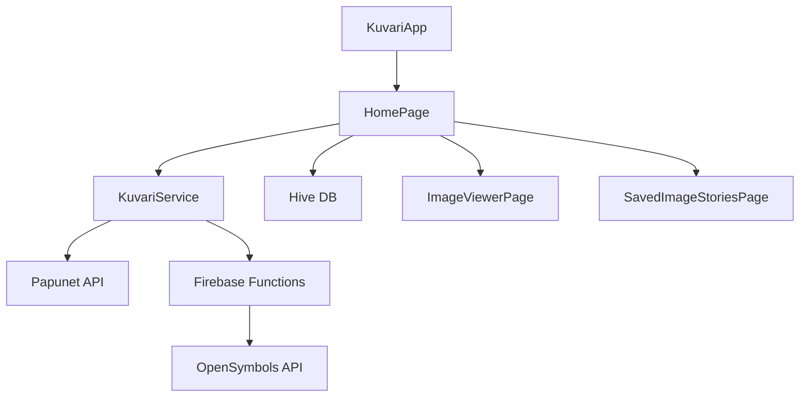

# Architecture

> Auto-generated by /map on 2026-02-14

## Overview

Kuvari is a Flutter-based application designed for image-based communication. It allows users to search for symbols and images from multiple sources (Papunet and OpenSymbols), select them into a "story" (sequence of images), and view or save these stories.

## Components

### [KuvariApp](file:///Users/juhanisnellman/dev/kuvari/lib/main.dart)
- **Purpose**: Root widget, handles app-wide state like Locale and initialization of Firebase and Hive.
- **Location**: `lib/main.dart`

### [HomePage](file:///Users/juhanisnellman/dev/kuvari/lib/pages/home_page.dart)
- **Purpose**: Main UI for searching and selecting images. Manages the current list of selected images and search results.
- **Location**: `lib/pages/home_page.dart`

### [KuvariService](file:///Users/juhanisnellman/dev/kuvari/lib/services/kuvari_service.dart)
- **Purpose**: Data layer that abstracts image searching logic. Handles switching between Papunet (direct HTTP) and OpenSymbols (via Cloud Functions).
- **Location**: `lib/services/kuvari_service.dart`

### [searchOpenSymbols](file:///Users/juhanisnellman/dev/kuvari/functions/index.js)
- **Purpose**: Firebase Cloud Function that proxies requests to the OpenSymbols API to keep secrets secure and handle token management.
- **Location**: `functions/index.js`

## Data Flow

1. **User Search**: User enters a query in `HomePage`. 
2. **Service Call**: `HomePage` calls `KuvariService.searchImages`.
3. **API Routing**: 
   - If language is 'en', `KuvariService` calls the `searchOpenSymbols` Firebase Function.
   - Otherwise, it calls the Papunet API directly via `http`.
4. **Result Parsing**: Results are converted into `KuvariImage` objects and returned to UI.
5. **Selection & Storage**: Selected images are added to a list in `HomePage` and can be saved as an `ImageStory` into a Hive box.

## Integration Points

| Service | Type | Purpose |
|---------|------|---------|
| Papunet API | HTTP REST | Primary symbol source for FI/SV |
| OpenSymbols API | HTTP REST (via Function) | Symbol source for EN |
| Firebase Crashlytics | SDK | Error reporting |
| Firebase Analytics | SDK | Usage tracking |

## Technical Debt

- [ ] **State Management**: Current use of `setState` at the root/page level may become difficult to maintain as complexity grows. Consider migrating to a more robust solution like Riverpod or Bloc.
- [ ] **Dependency Injection**: Services and controllers are passed manually through constructors.
- [ ] **Data Models**: `fromJson` logic is scattered; consider using `json_serializable` more consistently.
- [ ] **Category Logic**: Categories are hardcoded in `HomePage`.

## Conventions

- **State**: StatefulWidget + setState.
- **Persistence**: Hive for local storage.
- **API**: Future-based services returning model lists.
