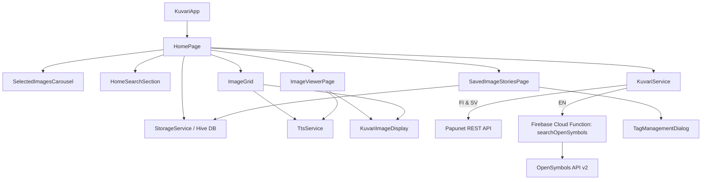

# Architecture

> Auto-generated by /map on 2026-09-13

## Overview

Kuvari is a Flutter-based assistive communication application designed for image- and symbol-based storytelling. It enables users to search for symbols and images from multiple sources (Papunet for Finnish and Swedish; OpenSymbols via Firebase Cloud Functions for English), assemble them into a sequential "story", play/view stories with text-to-speech audio narration in portrait or landscape mode, and manage saved stories with tags in local offline storage (Hive).


```mermaid
graph TD
    App[KuvariApp] --> Home[HomePage]
    Home --> Carousel[SelectedImagesCarousel]
    Home --> Search[HomeSearchSection]
    Home --> Grid[ImageGrid]
    Home --> Service[KuvariService]
    Home --> Storage[StorageService / Hive DB]
    Home --> Viewer[ImageViewerPage]
    Home --> SavedStories[SavedImageStoriesPage]

    Grid --> TTS[TtsService]
    Viewer --> TTS
    Viewer --> ImageDisplay[KuvariImageDisplay]
    Grid --> ImageDisplay

    Service -->|FI & SV| Papunet[Papunet REST API]
    Service -->|EN| CloudFn[Firebase Cloud Function: searchOpenSymbols]
    CloudFn --> OpenSymbols[OpenSymbols API v2]

    SavedStories --> TagDialog[TagManagementDialog]
    SavedStories --> Storage
```

---

## Components

### Application Lifecycle & Infrastructure
- **[KuvariApp](file:///Users/juhani/dev/kuvari/lib/main.dart)**
  - **Purpose:** Root application widget. Initializes Firebase, Crashlytics error boundary via `runZonedGuarded`, Hive storage via `StorageService`, analytics observers, and localizations (`fi`, `sv`, `en`).
  - **Location:** `lib/main.dart`
  - **Dependencies:** `firebase_core`, `firebase_crashlytics`, `firebase_analytics`, `flutter_localizations`, `storage_service.dart`, `kuvari_service.dart`, `home_page.dart`

### Pages (Presentation Layer)
- **[HomePage](file:///Users/juhani/dev/kuvari/lib/pages/home_page.dart)**
  - **Purpose:** Primary application screen. Orchestrates query input, category filtering dialogs, symbol search results, image selection/reordering carousel, story saving, and navigation to viewer and saved stories.
  - **Location:** `lib/pages/home_page.dart`
  - **Dependencies:** `kuvari_service.dart`, `selected_images_carousel.dart`, `home_search_section.dart`, `image_grid.dart`, `category_selection_dialog.dart`, `home_app_bar.dart`, `tts_service.dart`

- **[ImageViewerPage](file:///Users/juhani/dev/kuvari/lib/pages/image_viewer_page.dart)**
  - **Purpose:** Fullscreen visual viewer for playing image stories. Adapts between portrait mode (`PageView` with paging and zoomable `InteractiveViewer`) and landscape mode (horizontal scrolling strip with navigation indicators). Integrates TTS audio playback for symbol names.
  - **Location:** `lib/pages/image_viewer_page.dart`
  - **Dependencies:** `kuvari_image.dart`, `kuvari_image_display.dart`, `tts_service.dart`

- **[SavedImageStoriesPage](file:///Users/juhani/dev/kuvari/lib/pages/saved_image_stories_page.dart)**
  - **Purpose:** Manages saved stories stored in Hive. Supports text search filtering, multi-tag filtering, inline reorderable image previews, tag assignment dialogs, story deletion, and launching into viewer.
  - **Location:** `lib/pages/saved_image_stories_page.dart`
  - **Dependencies:** `image_story.dart`, `tag.dart`, `tag_management_dialog.dart`, `selected_images_carousel.dart`

- **[InfoPage](file:///Users/juhani/dev/kuvari/lib/pages/info_page.dart)**
  - **Purpose:** Displays attribution, legal/license details, and external web links for Papunet, OpenSymbols, and Rinnekodit.
  - **Location:** `lib/pages/info_page.dart`
  - **Dependencies:** `url_launcher`

### Widgets & Components
- **[KuvariImageDisplay](file:///Users/juhani/dev/kuvari/lib/widgets/kuvari_image_display.dart)**: Universal network image renderer supporting SVG files (`flutter_svg`) and raster formats (`Image.network`) with loading indicators and fallback error widgets.
- **[HomeAppBar](file:///Users/juhani/dev/kuvari/lib/widgets/home_app_bar.dart)**: Header bar containing language switcher dropdown, styled teal gradient, and quick actions (Save Story, Saved Stories, Info).
- **[HomeSearchSection](file:///Users/juhani/dev/kuvari/lib/widgets/home_search_section.dart)**: Search input wrapper with category filter trigger button and badge indicator.
- **[KuvariSearchBar](file:///Users/juhani/dev/kuvari/lib/widgets/kuvari_search_bar.dart)**: Custom search bar with clear button, submit trigger, and autofocus selection.
- **[SelectedImagesCarousel](file:///Users/juhani/dev/kuvari/lib/widgets/selected_images_carousel.dart)**: Horizontal drag-to-reorder list (`ReorderableListView`) displaying chosen story images with remove buttons and scroll arrows.
- **[ImageGrid](file:///Users/juhani/dev/kuvari/lib/widgets/image_grid.dart)**: Responsive 2- or 4-column grid rendering search results with selection checkmarks and TTS speech buttons.
- **[CategorySelectionDialog](file:///Users/juhani/dev/kuvari/lib/widgets/category_selection_dialog.dart)**: Modal multi-select checklist for Papunet symbol categories (`arasaac`, `kuvako`, `mulberry`, `sclera`, etc.).
- **[TagManagementDialog](file:///Users/juhani/dev/kuvari/lib/widgets/tag_management_dialog.dart)**: Management dialog for creating, editing, and assigning tags to saved stories.
- **[LanguageSelector](file:///Users/juhani/dev/kuvari/lib/widgets/language_selector.dart)**: Dropdown button for switching locales (`fi`, `sv`, `en`).

### Services & Data Layer
- **[KuvariService](file:///Users/juhani/dev/kuvari/lib/services/kuvari_service.dart)**: API abstraction layer. Dispatches search queries to Papunet REST API (`https://kuha.papunet.net/api/search/...`) for Finnish and Swedish, or calls Firebase Cloud Function `searchOpenSymbols` for English.
- **[StorageService](file:///Users/juhani/dev/kuvari/lib/services/storage_service.dart)**: Initializes Hive and Hive Flutter, registers model adapters (`ImageStoryAdapter`, `KuvariImageAdapter`, `TagAdapter`), and opens default boxes.
- **[StorageConstants](file:///Users/juhani/dev/kuvari/lib/services/storage_constants.dart)**: Box name constants (`imageStoriesBox`, `tagsBox`).
- **[TtsService](file:///Users/juhani/dev/kuvari/lib/services/tts_service.dart)**: Encapsulates `flutter_tts` speech synthesis, mapping application locales (`fi`, `sv`, `en`) to TTS locales (`fi-FI`, `sv-SE`, `en-US`).
- **[AnalyticsService](file:///Users/juhani/dev/kuvari/lib/services/analytics_service.dart)**: Structured analytics logging for search events, story creation, story viewing, info screen visits, and error tracking.
- **[ThemeService](file:///Users/juhani/dev/kuvari/lib/services/theme_service.dart)**: Central visual tokens (teal color palettes, gradients, button styles, app bar shapes).
- **[DialogService](file:///Users/juhani/dev/kuvari/lib/services/dialog_service.dart)**: Reusable modal dialogs for saving story titles and confirming story resets.

### Domain Models
- **[KuvariImage](file:///Users/juhani/dev/kuvari/lib/models/kuvari_image.dart)**: Hive typeId 1. Represents an individual symbol image (`author`, `name`, `thumb`, `url`, `uid`, `uuid`).
- **[ImageStory](file:///Users/juhani/dev/kuvari/lib/models/image_story.dart)**: Hive typeId 0. Represents a named sequence of `KuvariImage` items with associated `tagIds`.
- **[Tag](file:///Users/juhani/dev/kuvari/lib/models/tag.dart)**: Hive typeId 2. Categorization tag (`id`, `name`) for tagging image stories.

### Backend / Cloud Functions
- **[searchOpenSymbols](file:///Users/juhani/dev/kuvari/functions/index.js)**: Firebase v2 HTTPS callable Cloud Function (`onCall`). Authenticates with OpenSymbols API v2 using secret `OPENSYMBOLS_SECRET` with in-memory token expiration caching, queries `https://www.opensymbols.org/api/v2/symbols`, and returns standardized symbol objects.

---

## Data Flow

```
[User Interaction]
       │
       ▼
 [HomePage UI] ──(query, categories, locale)──► [KuvariService]
                                                        │
                      ┌─────────────────────────────────┴─────────────────────────────────┐
                      ▼                                                                   ▼
       (Language: 'fi' or 'sv')                                                   (Language: 'en')
                      │                                                                   │
                      ▼                                                                   ▼
         [Papunet REST API]                                                 [Firebase Cloud Function]
  (https://kuha.papunet.net/api/search)                                      (searchOpenSymbols: v2 onCall)
                      │                                                                   │
                      ▼                                                                   ▼
               [Raw JSON]                                                         [OpenSymbols API v2]
                      │                                                                   │
                      └─────────────────────────────────┬─────────────────────────────────┘
                                                        │
                                                        ▼
                                           List<KuvariImage>.fromJson
                                                        │
                                                        ▼
                                           [ImageGrid Display in UI]
                                                        │
                                                        ▼
                                           [User Selects & Orders]
                                                        │
                                                        ▼
                                          [SelectedImagesCarousel]
                                                        │
                                ┌───────────────────────┴───────────────────────┐
                                ▼                                               ▼
                     [Save to Hive Storage]                             [Open ImageViewerPage]
              (ImageStory Box & Tag Box via StorageService)             (InteractiveViewer & TTS Narration)
```

---

## Integration Points

| Service / Integration | Type | Purpose | Authentication / Credentials |
|-----------------------|------|---------|------------------------------|
| **Papunet API** | REST HTTP GET | Symbol and image search for Finnish (`fi`) and Swedish (`sv`/`se`) | Public endpoint (`kuha.papunet.net`) |
| **OpenSymbols API v2** | REST HTTP (Proxied via Cloud Function) | Symbol search for English (`en`) | Secured by Firebase Cloud Function using `OPENSYMBOLS_SECRET` |
| **Firebase Cloud Functions** | Callable HTTPS (v2) | Secret protection and API proxy for OpenSymbols token exchange | Firebase project authentication |
| **Firebase Crashlytics** | SDK | Unhandled error logging, crash boundary, and diagnostics | `firebase_options.dart` configuration |
| **Firebase Analytics** | SDK | User action telemetry (searches, story saves, page views) | `firebase_options.dart` configuration |
| **Hive Local DB** | Embedded NoSQL | Offline-first persistence for saved image stories and user tags | Local filesystem / App documents directory |
| **Flutter TTS Engine** | Platform Channel | Audio speech synthesis for symbol names | Native OS TTS engine (Android/iOS) |

---

## Conventions

- **Architecture:** Layered approach (`pages/` -> `widgets/` -> `services/` -> `models/`).
- **Persistence:** Hive objects with generated type adapters (`*.g.dart`) via `hive_generator`.
- **State Management:** `StatefulWidget` with local `setState` for page state; `ValueListenableBuilder` listening to Hive box changes for reactive data updates.
- **Localization:** Flutter `AppLocalizations` generated from `.arb` files (`intl_fi.arb`, `intl_sv.arb`, `intl_en.arb`) with default locale `fi`.
- **Styling:** Unified palette centered on Teal (`Colors.teal`), with common tokens defined in `ThemeService`.
- **Testing:** Unit and widget tests in `test/` using `flutter_test`, `mockito`, `network_image_mock`, and `hive_test`. 42 passing test suites.

---

## Technical Debt

### Static Analysis & Lints (19 issues)
- [ ] **Async Context Usage (`use_build_context_synchronously`):** `lib/pages/home_page.dart` (lines 90, 98, 100, 225, 227, 236) and `lib/widgets/tag_management_dialog.dart:91` access `BuildContext` after asynchronous operations without `if (!mounted) return;` guards.
- [ ] **Deprecated Reorder API:** `lib/widgets/selected_images_carousel.dart:107` uses `onReorder`, which is deprecated after Flutter v3.41 in favor of `onReorderItem`.
- [ ] **Unused Field:** `_maxVisibleImages` in `lib/pages/saved_image_stories_page.dart:35` is defined but unused.
- [ ] **Unused Import:** `lib/services/dialog_service.dart:3` imports `kuvari_image.dart` unnecessarily.
- [ ] **Test File Warnings:** `test/pages/saved_image_stories_page_test.dart` has an unused import, non-overriding method declaration, and unused `createSanityWidget`; `test/smoke_test.dart` has an unused import; `test/widgets/image_grid_test.dart` has an unnecessary mockito import.
- [ ] **Code Modernization Lints:** Info warnings for `prefer_final_fields` (`_selectedImages`), `use_super_parameters` (`InfoPage`), and `prefer_conditional_assignment` (`AnalyticsService`).

### Dependency & Build Health
- [ ] **Discontinued Dev Dependencies:** `build_resolvers` and `build_runner_core` are flagged as discontinued by pub.dev due to older constraints on `build_runner: ^2.3.3` and `hive_generator: ^2.0.1`.
- [ ] **Outdated Packages:** 47 upgradable dependencies in `pubspec.lock` (including Firebase plugins: `cloud_functions`, `firebase_analytics`, `firebase_core`, `firebase_crashlytics`).
- [ ] **Node.js Cloud Functions:** `functions/` contains npm security overrides in `package.json` for `qs` and `uuid`; periodic audit required.

### Architecture Improvements
- [ ] **Page-Level State Coupling:** `HomePage` manages search queries, filter states, carousel ordering, dialog popups, and navigation in a single large `State` class (~400 lines). Extracting business logic into a controller or state notifier would improve testability.
- [ ] **Manual Service Instantiation:** Services (`KuvariService`, `TtsService`, `AnalyticsService`) are instantiated directly inside widgets rather than injected via dependency injection or a service locator.
